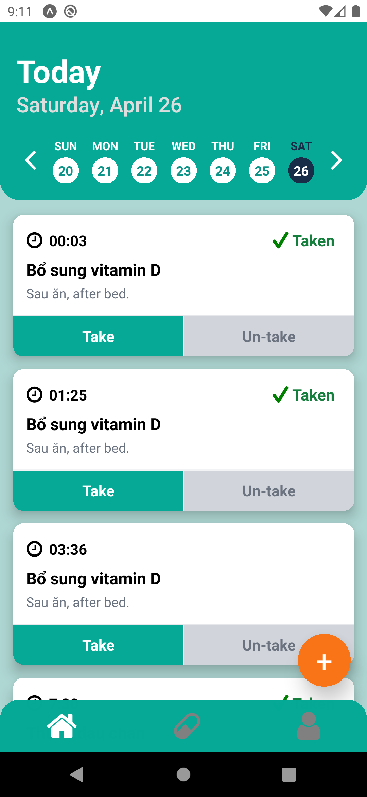
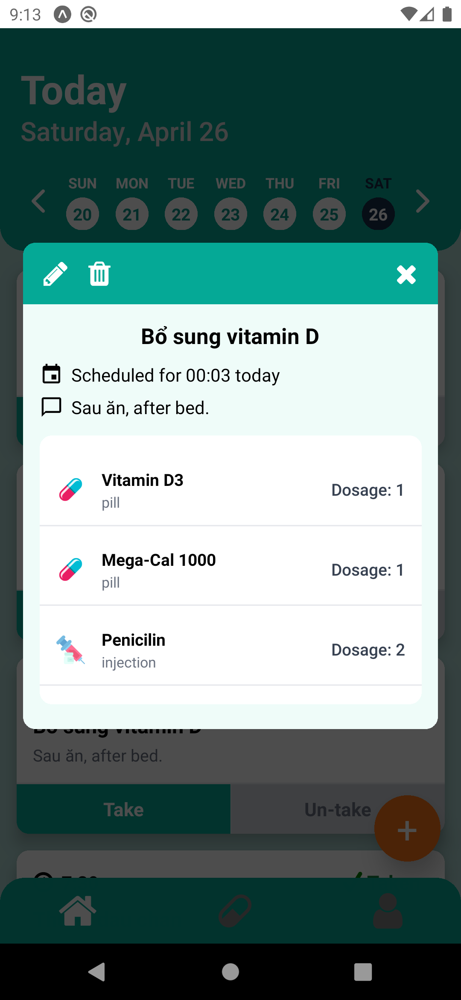

# Pill Pal

## 📖 Introduction
**Pill Pal** is a mobile application that helps users remember to take their medications on time. With a user-friendly interface and a smart notification system, Pill Pal improves medication adherence and supports better health management.

<p align="center">
  
  
</p>

## ✨ Features
- Send **main notifications** right at the scheduled medication times, showing detailed prescription info.
- Send **reminder notifications** if users haven't confirmed medication intake.
- Display the list of medicines and dosages directly in the notification.
- Modern, minimalistic, and easy-to-use interface.

## 🛠️ Technologies Used
- **React Native** (Expo Managed Workflow)
- **Expo Go** for rapid testing on real devices
- **Firebase** (Authentication, Firestore Database)
- **Local Notifications** for timely reminders
- **NativeWind** + **Tailwind CSS** for fast and responsive UI styling
- **GitHub Actions** for automating build and deployment processes (CI/CD)
- **SonarQube** for automatic code quality and security analysis

## 🚀 Getting Started

### 1. Clone the repository
```bash
git clone https://github.com/HowardPeter/med-reminder-app.git
cd pill-pal
```

### 2. Install dependencies
```bash
npm install
# or if you use yarn:
yarn install
```

### 3. Install Expo CLI (if not already installed)
```bash
npm install -g expo-cli
```

### 4. Start the application
```bash
npm start
```
